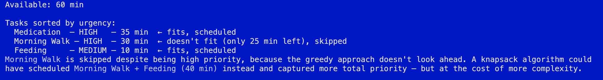
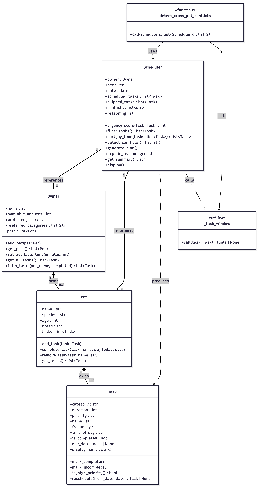

# PawPal+ Project Reflection

## 1. System Design

**a. Initial design**  
**Three core actions the user should be able to perform are:**
1. add a pet
2. a summary showing what should be done that day
3. schedule a service

- **Potential Edge Cases**
1. What if the owner has no time in that day?
2. More than 5 pets, scheduling complexity

- **Briefly describe your initial UML design.**  
In the initial design I kept it simple and followed the reqs from the README closely. After brainstorming with claude code
there were some clarity issuses for me, specifically understanding what the main objects would look like and how they connected to each other. And so after some refining I came to the understanding that there are 4 main objects for this app.

- **What classes did you include, and what responsibilities did you assign to each?**

The 4 main classes are:
1. **Task**: basically self contained data + behaviors(completetion state, reschedule logic).

2. **Pet**: owns a collection of Tasks and manages their lifecycle. Responsible for adding tasks, completing them, removing tasks by name, and returning all tasks via `get_tasks()`.

3. **Owner**: represents the person caring for the pets. Responsible for maintaining a list of pets, tracking daily available time in minutes, and storing scheduling preferences. Also provides `get_all_tasks()` and `filter_tasks()` to query across all pets.

4. **Scheduler**: planning engine that ties everything together for a specfic date.

**b. Design changes**

- **Did your design change during implementation?** 
Yes, at first there were 6 main objects, the 4 mentioned before plus 2: `DailyPlan` and `Calendar`. After 2/3 iterations it came back down to 4, eliminating the calendar entirely and aggregating `DailyPlan` and `Scheduler`.

- **If yes, describe at least one change and why you made it.** 
So `DailyPlan` isn't independent of `Scheduler`. It's just the output of the `Scheduler` so it was okay to fold its attributes in `Scheduler` directly to produce a cleaner design. Also the preferences are a bit complex since there's so many scenarios to consider. 

---

## 2. Scheduling Logic and Tradeoffs

**a. Constraints and priorities**

- **What constraints does your scheduler consider (for example: time, priority, preferences)?** 
It considers the owner's daily available time (in minutes), each task's priority and frequency of each task. Additionally, the owner's preferred tasks categories and fixed start times on tasks that must run at a specific time of the day. 

- **How did you decide which constraints mattered most?**  
Time budget is the hard constraint since no task can run if there's no time left, so it acts as the guardrails. Priority and frequency were ranked next because for example, missed medication is more critical than a missed grooming session. Preferences were treated as a soft tie breaker that only reorders tasks already eligible to be scheduled for the specified owner.

**b. Tradeoffs**

- **Describe one tradeoff your scheduler makes.** 
One tradeoff was to apply a greedy approach when parsing the priorities of a task with a specific time window. Claude code explains it as such: 

- **Why is that tradeoff reasonable for this scenario?**
It's reasonable as to reduce complexity of the code where the intention is to make code more human readable which in then more maintainable. 

---

## 3. AI Collaboration

**a. How you used AI**

- **How did you use AI tools during this project (for example: design brainstorming, debugging, refactoring)?** 
I used claude chat during the initial design phase just to have a general idea of what the requirements were asking. From there UML, debugging and refactoring were all done alongside claude code.

- **What kinds of prompts or questions were most helpful?** 
Prompts that pointed directly to the line in a file were executed faster than just describing the desired behaviors. Setting an intention also helped and when I wasn't sure if what I described gave enough context I added at the end of the prompt; Is there anything else we need to consider before "x" behavoir or "x" pattern is implemented/debugged/action?, as a way to cut the fat and get closer to the desired result.

**b. Judgment and verification**

- **Describe one moment where you did not accept an AI suggestion as-is** 
When building out pawpal_system.py, claude code included a method in the `Owner` object called `avoid_categories()` which held a list of categories to avoid to add further filtering capabilites. I found it redundant and could introduce unnecessary complexity so I excluded it from the implementation.

- **How did you evaluate or verify what the AI suggested?** 
I verified the outcome against what the initial intention was and also what the requirements are for the project. If the output satisfied those two conditions, I keep the suggestion. And yes later on testing is done to solidifiy if it stays or not.

---

## 4. Testing and Verification

**a. What you tested**

- **What behaviors did you test?**  
I tested the full lifecycle of each class i.e. task completion/rescheduling, pet task management (add, complete, duplicate prevention), owner filtering across pets, and all scheduler behaviors (urgency scoring, time budgeting, priority ranking, category promotion, chronological sorting, and reasoning output).

- **Why were these tests important?** 
To ensure the app functions the way it's supposed to and also to reveal any blindspots that may have been missed during the current iteration. 

**b. Confidence**

- **How confident are you that your scheduler works correctly?** 
I'm 9/10 confident it works as intended.

- **What edge cases would you test next if you had more time?** 
I couldn't think of anything but claude suggested if a "single task exceeds the owner's full time budget". Looking at the tasks and considering the real world, one would assume that an owner would have at least 1 hour to handle tasks for their pet however in simulation, 5 mins budgets are acceptable. Probably having a minimum time allowed could help cover scenarios like this.

---

## 5. Reflection

**a. What went well**

- **What part of this project are you most satisfied with?** 
I'm happy with the modular design and the readability of the code.

**b. What you would improve**

- **If you had another iteration, what would you improve or redesign?** 
I would add a calendar system to the app so that the user can have a general sense of what's happening during the week. I would also improve the UI/UX so that there's less scrolling and everything is more connected and compact. 

**c. Key takeaway**

- **What is one important thing you learned about designing systems or working with AI on this project?** 
I learned to respect the tool. At first I would insert typos and not check over my prompt but as I started refining my queries and fixing spelling errors, puntuation etc, I started getting sharper responses and even suggestion to alternatives. The trade off is effort yes, however you save time and become a effecient and effective programmer.

## 6. UML Diagram

